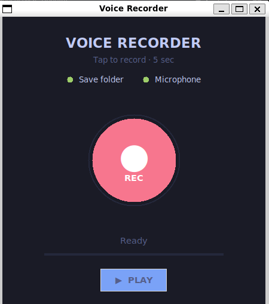
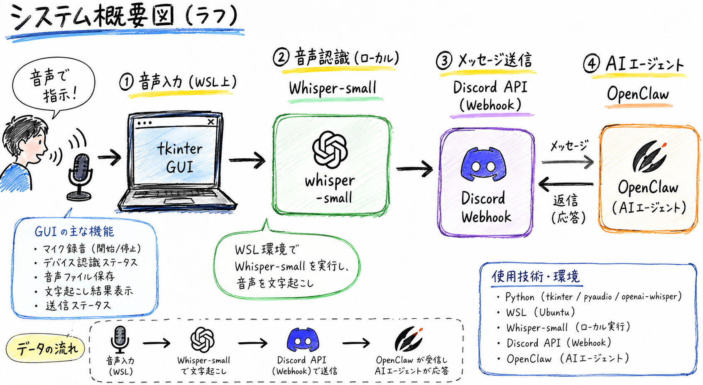

## はじめに

本記事は植物ロボットにAIエージェントの機能を実装した際の内容になります。突然ですが、植物を枯らした経験はないでしょうか？水やりを忘れ気が付いたら枯れてしまっている植物が「のどが渇いた」・「暑い」・「もっと日に当たりたい」など自ら言葉を発することで長生きさせられると考えました。そのためにどのような工夫をしたのかを記載します。
植物ロボットはシリーズ記事として記載しますので、よければ前回の概要についての記事を合わせてご覧ください。

前回の記事はこちら
https://zenn.dev/secondselection/articles/dev_plant_robot_1

## 植物ロボットに生命が宿った日

植物ロボットに生命を宿すべく、自律型AIエージェント基盤のOpenClawを利用しました。
Openclawを利用することでClaudeやGPTモデルといったAPIを利用したAIエージェントを育成できます。
UIはDiscordやTelegram等、多様な選択肢が用意されています。

OpenClawを植物ロボットに導入し、搭載されているWebカメラを利用して日記を作成してもらった時の様子です。
AIはClaudeを利用しており（後にGPTへ移行しますが）、Claudeの画像認識を利用して、写真から私を特定していました。
スピーカーも搭載しており、日記内容は植物ロボットが読み上げます。不思議なことに画像認識と音声合成を組み合わせることで植物ロボットに愛着がわきました。

## 自己認識

植物ロボットに人格を与えるために、Webカメラを利用して自身の写真を撮影してもらいました。ここまで植物ロボットに搭載している植物の名前を知りませんでしたが、パキラであると写真から植物ロボットが特定し、少し驚きました。

## センサーの値から気分を発話させる

現在の気分を発話させるために、土壌湿度センサーと光センサーの値を定期的に読み取らせ、現在の気分を発話させるようにしました。土壌湿度とは地面の土の中に含まれている水分の量や、土の湿り気のことを指します。たとえば土が乾いていれば「水が欲しいです」、逆に土が濡れすぎていると「水が多すぎます」と発生します。光センサーと組み合わせることで、日光量＋水分量を基準とした気分を発話します。太陽が当たっていて、水分量も適切である状態が多くの植物にとっては理想ですので、体調を自己管理してもらっているとも言えます。

今回利用した土壌湿度センサ、光センサはアナログ電圧が出力されるのでA/D変換を行い0~1023の範囲に変換しています。例えば土壌湿度センサでは値が低いほど湿っている、高いほど乾燥しているという形で植物ロボットにセンサ値を自己判断させています。
なお基準値を与えないと実際は湿っているのに「乾いている」と誤判定するケースがありましたので、400代が丁度良い水分量と基準を与える必要がありました。

## 人格の入れ替え

植物ロボットを動かすため、裏ではClaudeのサブスクリプションを利用していました。しかしAnthropic側でサードパーティ利用が禁止されたことを受け、GPTへ切り替えました。モデルの切り替え直後はモデルの回答の癖などにより植物ロボットの人格が入れ替わった感覚がありました。会話を重ねることで違和感は次第に減っていきました。なお2026年8月現在はClaudeのサブスクリプションにサードパーティー利用枠が設けられています。

## 音声アプリの実装

植物ロボットと会話をする際に音声入力をしたかったので、音声アプリを作成しました。録音した音声ファイルをWhisperモデルで音声認識して、DiscordにAPIを通じて送信するという仕組みになります。ハードウェアの制限上、CPU推論でWhisper-smallを利用しました。音声認識に10秒程度かかり、精度も高くないため改善点はありますが、音声入力が可能になりました。実用レベルにもっていく場合、GPUを利用する、音声認識のAPIを利用されることをお勧めします。

## おわりに

今回植物ロボットにAI機能を追加してみて、生命を感じることができました。人間は対話相手が共通の言語を話し、自分を認識してくれていると愛着がわくのではないかという仮説が生まれました。
また、技術の面では音声認識や推論といった対話に必要な機能を実用レベルでローカルで動かすにはまだまだ高性能なコンピューターが必要であると再認識しました。

皆さんも一度、AIエージェントを実装してみてはいかがでしょうか。
