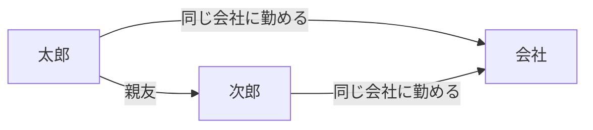
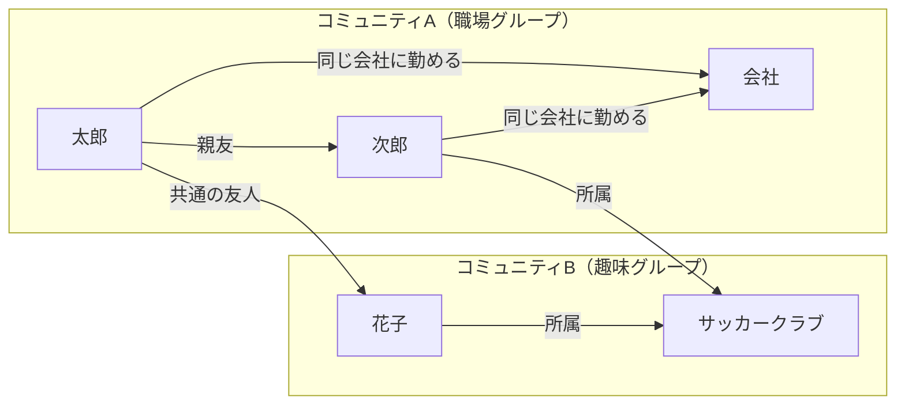

## はじめに

以下のリポジトリを参考に、**AutoGenとGraphRAGを組み合わせた類似レポート検索**を
試しました。レポート検索エージェントを作成し、ツールでのレポート検索を可能にしました。
結果として、キーワードが一致しない曖昧なクエリでも関係性をたどって類似文書を
見つけられることが確認できました。
同様の仕組みに興味がある方の参考になれば幸いです。

https://github.com/karthik-codex/Autogen_GraphRAG_Ollama

## 用語解説

:::details AutoGenとは
Microsoftが開発したオープンソースのAIエージェント開発フレームワークです。

AutoGenの詳細については下記記事を参照ください。

https://zenn.dev/secondselection/articles/ai_articles_generator

:::

:::details Microsoft GraphRAGとは
Microsoftが2024年に公開したRAGシステムです。従来のRAGに**ナレッジグラフ**を追加している点が特徴です。
以下2種類の検索方式が用意されています。

**2 種類の検索方式:**

- **Local Search**: 特定エンティティの詳細情報を取得
  - 例）「山田さんの人間関係を教えて」→ 山田さんに紐づく情報を詳しく取得
- **Global Search**: データセット全体のトピック・テーマを横断的に検索
  - 例）「人間関係を記した文書を教えて」→ 全文書を横断して関連するものを列挙
:::

### GraphRAGとは？

従来のRAGでは学習していない外部情報を参照できる利点がある一方で、純粋にクエリと類似
したベクトルを検索するだけで、文脈を考慮した検索が難しかったです。
例えば「家具のサブスクを扱う社内レポートを探して」というクエリに対して、文書内に「サブスク」ではなく「月額制レンタル」と書かれていた場合、従来のRAGではヒットしないことが
あります。
そこで文章の関係性をノードとエッジで表した**ナレッジグラフを作成し、情報検索をより高精度にするための技術**です。

GraphRAGの分かりやすい例として、**人物相関図**が挙げられます。「太郎と次郎は親友で、同じ会社に勤めている」という文章があるとき、太郎・次郎・会社がノード（点）になり、「親友」「同じ会社に勤める」がエッジ（線）になります。



「太郎の友人は誰？」と検索すれば、グラフの周辺を検索して次郎にたどり着けます。従来のRAGでは「太郎・友人」というキーワードが文書にそのまま含まれていないと検索が難しいですが、GraphRAGは関係性をたどれるため、曖昧な問いでも関連情報を引き出せます。

また、**コミュニティレポート**も生成します。



**コミュニティ**とは、グラフ内で「互いに密につながっているノードのまとまり」のことです。

- **コミュニティA**（職場グループ）: 太郎・次郎・会社は職場という文脈で強く結びついている
- **コミュニティB**（趣味グループ）: 花子・サッカークラブは趣味という文脈で結びついている
- コミュニティをまたぐエッジ（太郎↔花子、次郎↔サッカークラブ）が橋渡しになる

GraphRAGでは、このコミュニティを自動検出して各コミュニティのサマリーを生成します。「どのようなコミュニティがある？」のような質問に対して、個別のレポートではなく
コミュニティサマリーから回答できるため、全体像を把握した回答が可能になります。

ここまで多くの概念が出てきましたが、**人同士の関係性がノードとエッジ、人の所属している
集まりをコミュニティ**だと理解してもらえれば良いです。

それでは本題に入ります。

## システム構成


[引用元]https://github.com/karthik-codex/Autogen_GraphRAG_Ollama?tab=readme-ov-file

**ナレッジグラフのDBを作成し、エージェントがタスクに従って検索をするというシンプルな構成**です。
※今回はUIとLiteLLMは使用していません。

### 使用技術

| 役割 | 技術 | 備考 |
|------|------|------|
| グラフ構築・インデックス作成 | GraphRAG | Microsoft製 |
| インデックス作成LLM | OpenAI gpt-5-mini | エンティティ抽出・要約 |
| Embedding | OpenAI text-embedding-3-small | ベクトル化 |
| 検索・回答生成LLM | Ollama qwen3:14b | ローカル・無料 |
| エージェントフレームワーク | AutoGen | 検索エージェント |

### 対象データ

レポート検索をするため、5件の社内レポートをインデックス対象としました。家具関連の質問をすると**海外向け家具ECサイト、海外向け家具レンタル**がヒットすることを期待します。

```md
.
├── overseas_furniture_ec.md      # 海外向け家具ECサイト
├── overseas_furniture_rental.md  # 海外向け家具レンタル
├── internal_ai_productivity.md   # 社内AI活用・生産性向上
├── regional_tourism_dx.md        # 地域観光DX
└── manufacturing_automation.md   # 製造ライン自動化
```

## 実行フロー


### インデックス作成

インデックス作成にあたってコンテキスト制限回避や、ナレッジグラフの品質向上のために
テキストを**チャンキング**（分割）します。その後、分割されたテキストをもとにLLMでナレッジグラフを作成します。**ナレッジグラフの精度が後の検索精度に大きくかかわるので、出来るだけ性能の高いモデル**を選びましょう。今回は検証のためgpt-5-miniを選択しました。
グラフの構築が終わると**コミュニティレポートの作成**、**ベクトル化**（embedding）を行い
インデックスの作成が完了します。

構築されたナレッジグラフのイメージは以下の通りです。


### 検索フェーズ

エージェントがインデックスされたDBに検索をかけます。検索結果を用いて回答をします。

### 実行結果

```txt
--- user ---
家具のサブスクを企画したい

--- GraphRAGSearchAgent ---
[FunctionCall(id='call_Ol5RzhMMeSR0Dhg99ztXwVVY', arguments='{"query": "家具 サブスク サブスクリプション レンタル 月額 家具レンタル 社内レポート"}', name='graphrag_global_search'), FunctionCall(id='call_bxbntEbT2ExN57IXC5nC9vob', arguments='{"query": "家具のサブスク（家具レンタル/サブスクリプション） 企画 KPI 予算 ターゲット 収益モデル"}', name='graphrag_local_search')]

--- GraphRAGSearchAgent ---
家具サブスクの企画について、社内ナレッジグラフを検索したところ、近い既存企画として **「日本製家具のサブスク型レンタル（ルストーン関連）」** がヒットしました。以下、その企画情報を要約しつつ、あなたの企画に流用できる要素を整理します。

---

## 関連する社内レポート名と概要
### ルストーン関連：**日本製家具レンタルサービス（サブスクリプションモデル）**
- **概要**：日本製家具を**月額サブスクでレンタル提供**し、利用後に**購入オプション**も設けるモデル。物流面では**タイ・香港の倉庫**を活用して在庫/配送体制を組む計画。  
  [Data: Entities (133); Relationships (142); Sources (8)]

---

## 質問に直接関係する情報（ターゲット・KPI・予算など）

### ターゲット（展開エリア）
- 段階的な展開ターゲット（Phase）：
  - **Phase 2**：東京・神奈川で開始  
  - **Phase 3**：大阪・名古屋・福岡へ拡大  
  - **Phase 4**：シンガポール・タイへ海外展開  
  [Data: Relationships (131, 132, 133)]

### KPI（企画上の到達目標）
- 中核KPIとして **損益分岐点（Break-even Point）到達**（月次サブスク収入で運用コストをカバー）を設定。  
  [Data: Entities (125); Relationships (135)]
- KPIの考え方として、マーケ投資で**契約者獲得→損益分岐到達**を狙う構造が示されています。  
  [Data: Relationships (139)]

### 予算（初年度の内訳）
- 初年度投資計画（合計）：**7,100万円**  
  - 在庫調達：**3,000万円**  
  - 倉庫・物流：**800万円**（タイ・香港の在庫/物流体制整備）  
  - 予約/管理システム開発：**700万円**  
  - マーケティング：**500万円**  
  - 人件費：**1,800万円**  
  - 諸経費/予備：**300万円**  
  [Data: Sources (8)]

### 収益モデル
- **月額サブスク（レンタル）**が収益の柱。
- 追加の収益機会として、レンタル後の**購入オプション**（所有移転）を用意。  
  [Data: Entities (133); Relationships (142)]

---

## 比較サマリー（該当企画が複数あるか）
- 家具サブスクに関して、ナレッジグラフ上で「KPI・予算・フェーズ」まで具体記載が取れたのは上記の1系統でした。
- 他の「家具サブスク」社内レポート：**情報なし**（今回検索範囲では追加検出できず）

---

## 企画を作るために、まず確認したい3点
この既存企画（ルストーン型）をベースに、あなたの狙いに合わせて社内レポートの体裁（ターゲット/KPI/収支/運用）に落とせます。次だけ教えてください。

1) 主ターゲット：**個人（単身/ファミリー）** or **法人（社宅/オフィス）**  
2) 商品の出し方：**単品** or **部屋まるごとセット**  
3) 展開範囲：まずは **国内（どのエリア）** から？海外も想定？

```

### 実行結果について

結果は期待と違い、**海外向け家具レンタル**のみヒットしました。家具のサブスクという文脈で
見てみると、**海外向け家具ECサイト**はヒットしないのが正しそうです。
文脈の汲み取りは想定以上だった一方、出力を見てみると**ルストーン型**という社内レポートに
存在しない単語が含まれています。

## おわりに

今回はじめてGraphRAGを実際に動かしてみて、概念は理解しているつもりでしたが、より理解が深まりました。分かると出来るは違うという言葉を思い出しました。
ユーザーから曖昧なタスクが入力されることは容易に想定できるので、GraphRAGはそういった場面でも役立つと考えました。
グラフの品質がそのまま検索精度に直結するため、インデックス作成時のLLM選定が重要だという点も学びです。

今後はGraphRAGの検索精度向上や、より多種なレポートへの適用を試していきたいと考えています。
またエージェントの軌跡改善フローの作成も必要だと考えています。

## 参考資料

- https://microsoft.github.io/graphrag/
- https://qiita.com/ksonoda/items/98a6607f31d0bbb237ef#rag%E3%81%AE%E8%AA%B2%E9%A1%8C%E3%83%99%E3%82%AF%E3%83%88%E3%83%AB%E9%A1%9E%E4%BC%BC%E6%A4%9C%E7%B4%A2%E3%81%AE%E4%B8%8D%E7%A2%BA%E5%AE%9F%E6%80%A7
