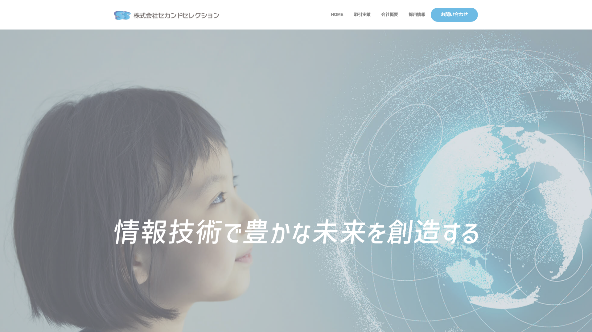
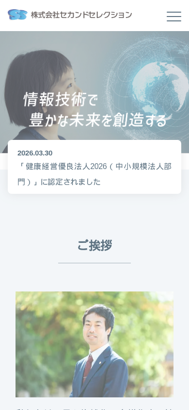

## はじめに

Playwrightを用いて、複数ブラウザでのレスポンシブ対応を自動化したいと考えました。

複数ブラウザを開いて、表示レイアウトを手動で変更するのは大変です。今回はそういった課題をClaude Code + Playwright MCPを利用して解決していきます。

用語等についてはこちらの記事をご参照ください。

https://zenn.dev/secondselection/articles/claude_playwright

## 要件について

ブラウザおよびサイズ要件は以下とします。

### ブラウザ要件

- Chromium（Chrome/Edge）
- Firefox
- WebKit（Safari）

### サイズ要件

- PC:1920px*1080px
- タブレット:768px*1024px
- スマホ:390px*844px

## 手順

今回は弊社のHPにアクセスしてレイアウトを確認していきます。
最初のステップとしてChromiumで3サイズをスクショできるようにします。
画像はフルサイズで撮影していますが、長くなってしまいますので、一部を切り取っています。

以下プロンプトは🤵マークを付与します。

`🤵https://www.secondselection.com/に1920*1080でアクセスして。`



無事にアクセス出来ていることが確認できたので、スマホ、タブレットも続けていきます。

`🤵次にスマホサイズ390px*844pxでアクセスして。`



`🤵次タブレットサイズ768px*1024pxでアクセスして。`


`🤵ここまでの作業をPlaywrightを利用したコードに書き起こして`

生成されたスクリプト

※汎用的に利用できるよう一部修正しています。

```js
const { chromium } = require('@playwright/test');
const fs = require('fs');
const path = require('path');

const URL = process.argv[2];
if (!URL) {
  console.error('Usage: node fullscreenshot.js <url>');
  process.exit(1);
}

const timestamp = new Date().toISOString().replace(/[:.]/g, '-');
const hostname = new globalThis.URL(URL).hostname.replace(/\./g, '_');
const archiveDir = path.join('archive', `${timestamp}_${hostname}`);
fs.mkdirSync(archiveDir, { recursive: true });

(async () => {
  const browser = await chromium.launch();

  // デスクトップ (1920x1080)
  const desktopPage = await browser.newPage();
  await desktopPage.setViewportSize({ width: 1920, height: 1080 });
  await desktopPage.goto(URL, { waitUntil: 'networkidle' });
  await desktopPage.screenshot({ path: path.join(archiveDir, 'desktop.png'), fullPage: true });
  await desktopPage.close();

  // スマホ (390x844)
  const mobileContext = await browser.newContext({
    viewport: { width: 390, height: 844 },
    isMobile: true,
    hasTouch: true,
  });
  const mobilePage = await mobileContext.newPage();
  await mobilePage.goto(URL, { waitUntil: 'networkidle' });
  await mobilePage.screenshot({ path: path.join(archiveDir, 'mobile.png'), fullPage: true });
  await mobileContext.close();

  // タブレット (768x1024)
  const tabletPage = await browser.newPage();
  await tabletPage.setViewportSize({ width: 768, height: 1024 });
  await tabletPage.goto(URL, { waitUntil: 'networkidle' });
  await tabletPage.screenshot({ path: path.join(archiveDir, 'tablet.png'), fullPage: true });
  await tabletPage.close();

  await browser.close();

  console.log(`Saved to: ${archiveDir}`);
})();

```

### 注意点

動的なサイトは適宜設定が必要です。スクリプト実行時に真っ白なもの画面が撮影されました。対策としてネットワークリクエストが500ms以上発生しなくなるまで待機する`waitUntil: 'networkidle'` を各gotoに追加しています。場合によっては特定の要素が表示されるのを待つ設定が必要です。

### 複数ブラウザ対応

単一ブラウザで動作確認が出来ましたので、複数ブラウザ対応は順調に進みました。
chromium、firefoxは順調にいきましたがsafariで失敗しました。WSL2環境ではWebKitの依存ライブラリ（libEGL, libGLESなど）が揃わないため起動できないそうです。
必要なライブラリが多く、環境構築の難易度を考慮して、今回はスキップする仕様にしました。

```js
const { chromium, firefox, webkit } = require('@playwright/test');
const fs = require('fs');
const path = require('path');

const URL = process.argv[2];
if (!URL) {
  console.error('Usage: node capture.js <url>');
  process.exit(1);
}

const timestamp = new Date().toISOString().replace(/[:.]/g, '-');
const hostname = new globalThis.URL(URL).hostname.replace(/\./g, '_');
const archiveDir = path.join('archive', `${timestamp}_${hostname}`);
fs.mkdirSync(archiveDir, { recursive: true });

const viewports = [
  { name: 'desktop', width: 1920, height: 1080, isMobile: false },
  { name: 'tablet',  width: 768,  height: 1024, isMobile: false },
  { name: 'mobile',  width: 390,  height: 844,  isMobile: true  },
];

const browsers = [
  { name: 'chromium', launcher: chromium },
  { name: 'firefox',  launcher: firefox  },
  { name: 'webkit',   launcher: webkit   },
];

(async () => {
  for (const { name: browserName, launcher } of browsers) {
    let browser;
    try {
      browser = await launcher.launch();
    } catch (e) {
      console.warn(`Skipping ${browserName}: ${e.message.split('\n')[0]}`);
      continue;
    }

    for (const { name: vpName, width, height, isMobile } of viewports) {
      const contextOptions = { viewport: { width, height } };
      if (browserName !== 'firefox') {
        contextOptions.isMobile = isMobile;
        contextOptions.hasTouch = isMobile;
      }
      const context = await browser.newContext(contextOptions);
      const page = await context.newPage();
      await page.goto(URL, { waitUntil: 'networkidle' });
      await page.screenshot({ path: path.join(archiveDir, `${browserName}-${vpName}.png`), fullPage: true });
      await context.close();
      console.log(`Captured: ${browserName}-${vpName}`);
    }

    await browser.close();
  }

  console.log(`Saved to: ${archiveDir}`);
})();

```

## おわりに

最終的にはchromium,firefoxのブラウザでPC、スマホ、タブレットの計6枚のスクショを自動化することが出来ました。
